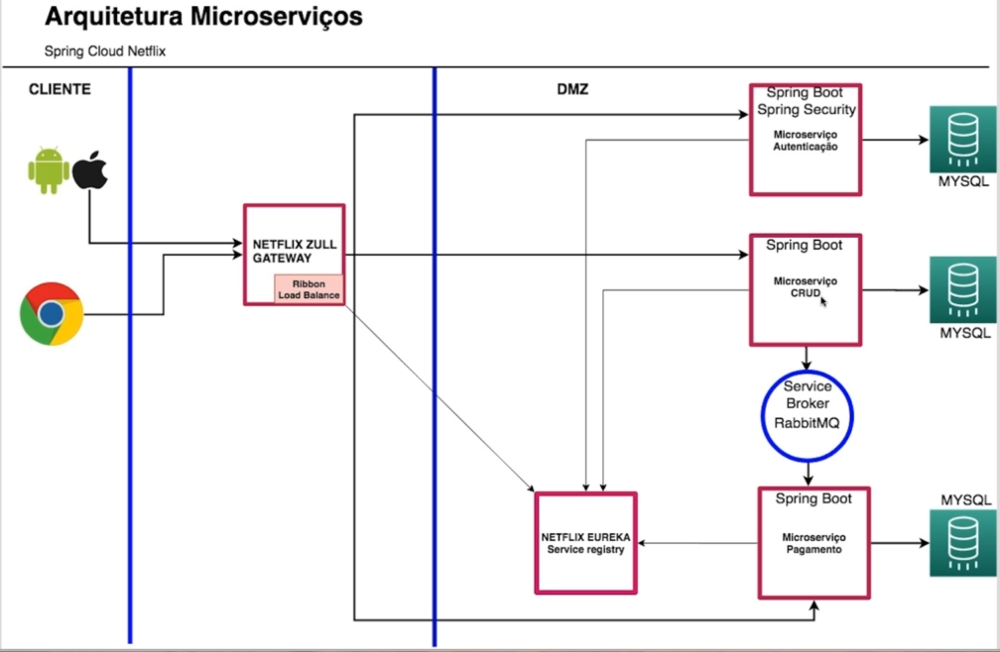
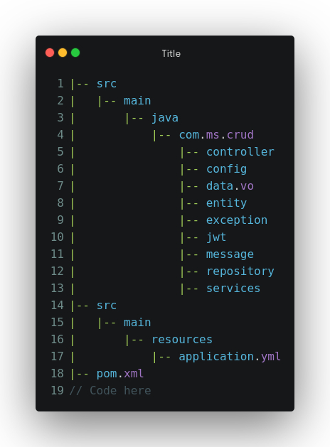
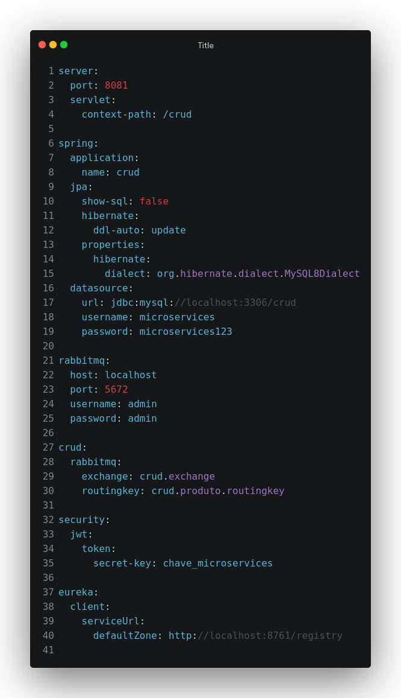
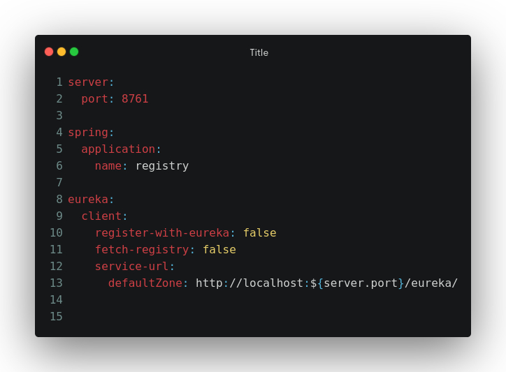
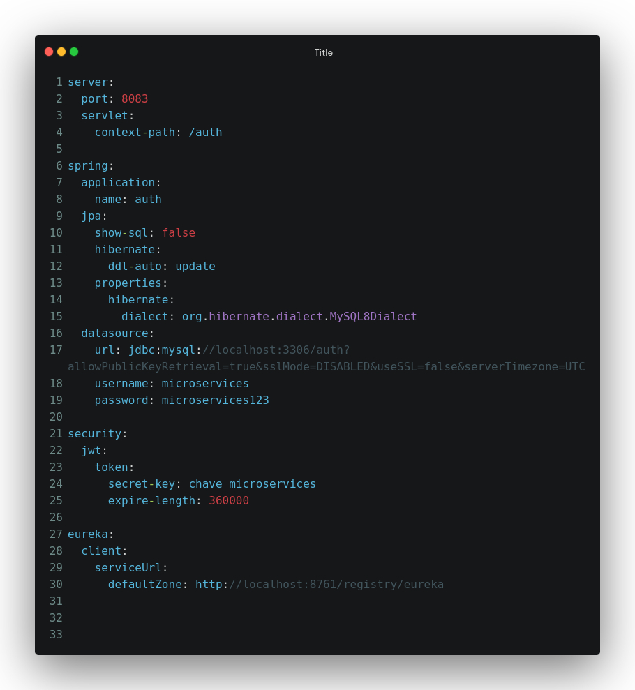
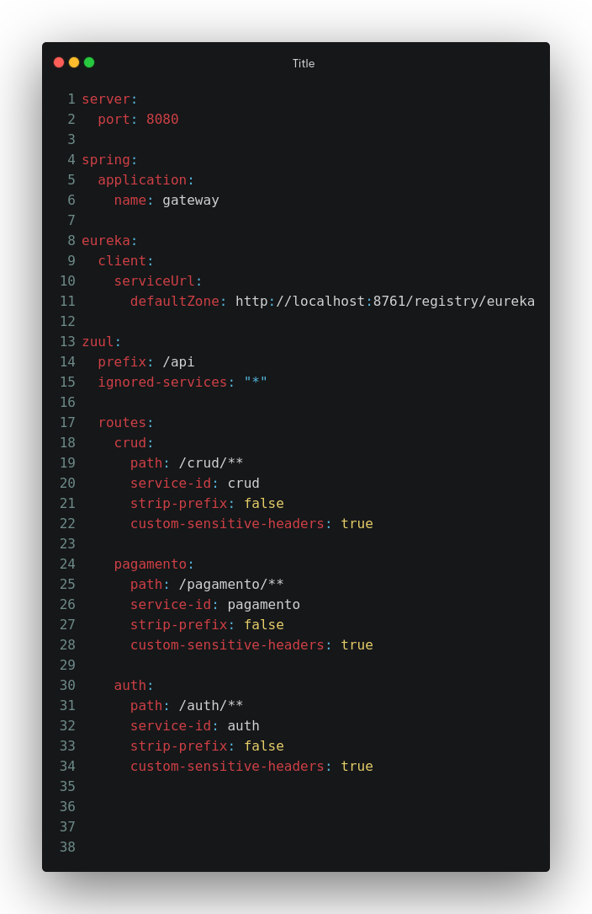

# Projeto

Este projeto demonstra uma arquitetura de microsserviços utilizando diversas tecnologias modernas para criar uma solução robusta, escalável e segura. Ele inclui serviços como registro e descoberta de serviços, gateway de roteamento, segurança com JWT, mensageria com RabbitMQ e persistência de dados com MySQL.

## Tecnologias Utilizadas

* Spring Boot: Framework para desenvolvimento de aplicações Java, facilitando a configuração e o desenvolvimento.
* Spring Security: Implementação de segurança para proteger endpoints e controlar o acesso.
* Spring Data JPA: Abstração para acesso a dados usando JPA, facilitando a interação com bancos de dados relacionais.
* Netflix Eureka: Service registry para registro e descoberta de serviços na arquitetura de microsserviços.
* Netflix Zuul: API Gateway para roteamento dinâmico, monitoramento e segurança de microserviços.
* RabbitMQ: Broker de mensagens para comunicação assíncrona entre microsserviços.
* MySQL: Banco de dados relacional para persistência de dados de forma estruturada.
* Docker: Para containerização e execução do RabbitMQ e outros serviços.

### Configuração do Docker para RabbitMQ

Para executar o RabbitMQ usando Docker, você pode usar o seguinte comando:

docker run -d --name rabbitmq -p 5672:5672 -p 15672:15672 rabbitmq:3.8.3-management

Este comando irá:

* Baixar a imagem do RabbitMQ com a tag 3.8.3-management (que inclui o plugin de gerenciamento).
* Criar um contêiner chamado rabbitmq.
* Mapear a porta 5672 para comunicação do RabbitMQ e a porta 15672 para o console de gerenciamento do RabbitMQ.

Verificando o status do contêiner RabbitMQ

Para verificar o status do contêiner RabbitMQ, use o comando:

docker ps -a

Você verá uma saída similar a esta:

CONTAINER ID   IMAGE                       COMMAND                  CREATED          STATUS                        PORTS                                                                          NAMES
051c8c7197b4   rabbitmq:3.8.3-management   "docker-entrypoint.s…"   2 months ago     Exited (0) 4 weeks ago                                                                                 compose_rabbitmq_1

Se o contêiner estiver parado (como mostra o exemplo Exited (0) 4 weeks ago), você pode iniciá-lo novamente com:

docker start rabbitmq

### Acessando o Console de Gerenciamento do RabbitMQ

Após iniciar o contêiner, você pode acessar o console de gerenciamento do RabbitMQ em: http://localhost:15672.

As credenciais padrão são:

    Username: guest
    Password: guest

## Estrutura do Projeto

### Microserviço CRUD

Microserviço desenvolvido com Spring Boot com maven usando versão do java 11 para gerenciar operações CRUD de produtos.

#### Estrutura de Diretórios

#### Descrição dos Componentes

* Controller: Define os endpoints para operações CRUD de produtos.
* Config: Configurações de segurança (JWT) e RabbitMQ.
* Entity: Representação das entidades JPA para persistência no banco de dados.
* JWT: Manipulação e validação de tokens JWT para autenticação.
* Services: Implementação da lógica de negócios e operações de CRUD.
* Exception: Manipulação de exceções personalizadas para tratamento de erros.
* Message: Integração com RabbitMQ para envio e recebimento de mensagens.

application.yml

### Microserviços

#### Microserviço de Pagamento

Gerencia operações de venda e produtos vendidos em um sistema de e-commerce.

* VendaController: Controlador REST para operações de vendas.
* VendaService: Serviço para operações de negócio relacionadas a vendas.
* Entidades: Inclui classes como Venda, ProdutoVenda, Produto.

#### Endpoints Principais:

* GET /venda/{id}: Retorna detalhes de uma venda específica.
* GET /venda: Retorna uma lista paginada de vendas.
* POST /venda: Cria uma nova venda.

### Microserviço de Descoberta (Discovery Server)

Implementa um servidor de descoberta usando Spring Cloud Netflix Eureka.

application.yml

#### Microserviço de Autenticação (Auth Service)

Utiliza Spring Security e JWT para gerenciamento de autenticação e segurança.

application.yml

#### Microserviço Gateway

API Gateway para roteamento de requisições entre diferentes microsserviços.

application.yml

### Como Executar

Certifique-se de ter as dependências configuradas corretamente no ambiente de desenvolvimento. Utilize o comando mvn spring-boot:run ou execute a aplicação diretamente a partir da sua IDE preferida.

### Objetivos de Aprendizado

Ao concluir este projeto, você terá adquirido conhecimento e prática nas seguintes áreas:

* Arquitetura de Microsserviços: Entendimento dos conceitos, benefícios e desafios.
* Service Discovery com Netflix Eureka: Configuração e uso para registro e descoberta de serviços.
* Gateway com Netflix Zuul: Implementação para roteamento e segurança.
* Mensageria com RabbitMQ: Comunicação assíncrona entre microsserviços.
* Segurança com Spring Security e JWT: Implementação de autenticação e autorização robustas.
* Integração com Spring Data: Acesso e manipulação de dados com MySQL.
* Gerenciamento de Dependências com Maven: Configuração e construção do projeto.

Este projeto é uma oportunidade de aprender na prática como integrar diversas tecnologias modernas para criar uma arquitetura de microsserviços robusta, escalável e segura.

